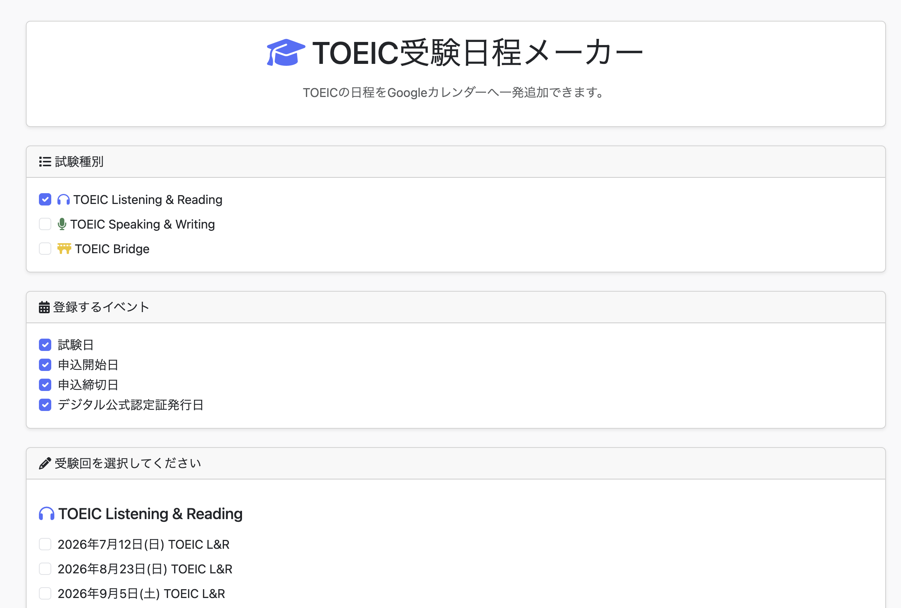

# TOEIC Calendar Generator

TOEIC Listening & Reading / Speaking & Writing / Bridge の
公開テスト日程を Google カレンダーへ簡単に追加できる Web アプリです。

受験予定の回を選択するだけで、Google カレンダーに登録可能な  
ICS ファイルを自動生成します。

## 🌐 Demo

https://tsukuba42195.sakura.ne.jp/toeic/

## 📷 Screenshot

## ✨ Features

- TOEIC公開テストの日程を一覧表示
- 受験したい回を選択可能
- Googleカレンダーへワンクリックで追加
- ICSファイルを自動生成
- スマートフォン対応
- シンプルで分かりやすいUI

## 🚀 How to Use

1. 試験種別を選択します。
2. 「受験回を選択してください」から希望する回を選択します。
3. 「Googleカレンダーへ追加」をクリックします。
4. ダウンロードされた `.ics` ファイルを開くと、Googleカレンダーへ予定を追加できます。

## 🛠 Built With

- PHP
- Bootstrap 5
- iCalendar (.ics)

## 📂 Files

| File | Description |
|------|-------------|
| `index.php` | メイン画面 |
| `generate.php` | ICSファイル生成処理 |
| `demo.png` | デモ画面 |

## 📄 License

MIT License

## 👨‍💻 Author

向井聡（Akira Mukai）

- Blog: https://s0323861.github.io/
- GitHub: https://github.com/s0323861

---

This project is not affiliated with or endorsed by ETS or IIBC.
TOEIC is a registered trademark of Educational Testing Service (ETS).
